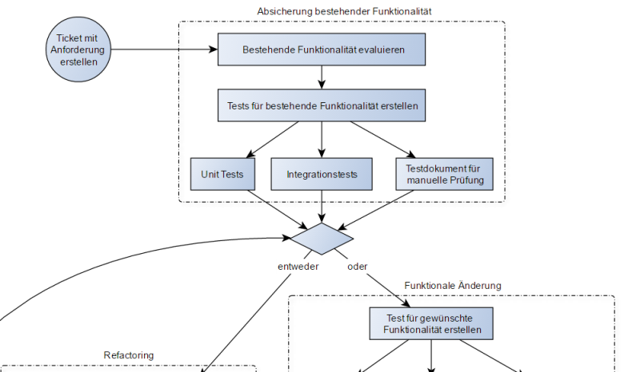

M300 - 35 Container-Sicherheit
==============================

Diese Wikiseite zeigt, wie Container mit betriebenen Applikationen und Services in Punkto Qualität und Schutz abgesichert werden können.

#### Lernziele

Sie kennen Möglichkeiten für die Protokollierung & Überwachung, Absicherung von Containern und können Container automatisch builden.

#### Voraussetzungen
* [10 Toolumgebung aufsetzen](../10-Toolumgebung/)
* [30 Container](../30-Container/)

#### Inhaltsverzeichnis
* 01 - [Protokollieren & Überwachen](#-01---protokollieren--%C3%BCberwachen)
* 02 - [Container sichern & beschränken](#-02---container-sichern--beschr%C3%A4nken)
* 03 - [Kontinuierliche Integration](#-03---kontinuierliche-integration)
* 04 - [Fragen](Fragen.md)

___

 01 - Protokollieren & Überwachen
======

> [⇧ **Nach oben**](#inhaltsverzeichnis)

Ein effektives Überwachen und Protokollieren laufender Container ist ausgesprochen wichtig, wenn man ein nichttriviales System am Laufen halten und Probleme effektiv debuggen will.

Bei einer Microservices-Architektur werden Protokollieren und Überwachen aufgrund der grösseren Zahl von Rechnern sogar noch wichtiger.

Angesichts der kurzlebigen Natur von Containern kann es sein, dass ein gegebener Container zum Zeitpunkt des Debuggens gar nicht mehr existiert, was zentrale Logs unabdingbar macht.


### Logging
***
Wenn man keine besonderen Argumente angegeben hat und keine Logging-Software zum Einsatz kommt, protokolliert Docker alles, was an `STDOUT` oder `STDERR` geschickt wird.

Die Logs können dann über den Befehl `docker logs` abgerufen werden.

Es gibt eine Reihe Logging-Methoden, die man über das Argument `--log-driver` von `docker` run auswählen kann.

Mögliche Werte sind unter anderem:
* *json-file*
    * Das Standard-Logging
* *syslog*
    * Der Syslog-Treiber des Hosts
* *none*
    * Schaltet die Protokollierung ab

**Standard-Logging (JSON-File)** <br>
Einfache Ausgaben abholen:
```Shell
    $ docker run --name logtest ubuntu bash -c 'echo "stdout"; echo "stderr" >>2'
    $ docker logs logtest
    $ docker rm logtest
```

Laufende Ausgaben anzeigen:
```Shell
    $ docker run -d --name streamtest ubuntu bash -c 'while true; do echo "tick"; sleep 1; done;'
    $ docker logs streamtest 
    $ docker logs streamtest | wc -l
    $ docker rm streamtest
```

**Syslog** <br>
Protokollierung in das System-Log (syslog) des Hosts:
```Shell
    $ docker run -d --log-driver=syslog ubuntu bash -c 'i=0; while true; do i=$((i+1)); echo "docker $i"; sleep 1; done;'
    $ tail -f /var/log/syslog
```


### Überwachen und Benachrichtigen
***
In einem Microservices-System wird man vermutlich dutzende, wenn nicht gar hunderte oder tausende laufende Container nutzen. Beim Überwachen des Status der Container und des Systems im Allgemeinen will man als Administrator dabei so viel Hilfe wie möglich haben.

Eine gute Monitoring-Lösung sollte auf einen Blick den Zustand des Systems zeigen und rechtzeitig warnen, wenn Ressourcen knapp werden (z.B. Speicherplatz, CPU, RAM).

Ausserdem wollen wir informiert werden, wenn etwas anfängt schiefzulaufen (wenn z.B. Requests mehrere Sekunden brauchen, bis sie verarbeitet sind).

**Docker Tools**
cAdvisor (Abkürzung von "Container Advisor") von Google ist das am häufigsten eingesetzte Monitoring-Tool für Docker.

Es bietet einen grafischen Überblick über den Ressourceneinsatz und Performance-Metriken von Containern, die auf dem Host laufen.

Da cAdvisor selbst als Container zur Verfügung steht, können wir das Tool in kürzester Zeit zum Laufen bringen. Gestartet wird der cAdvisor-Container mit folgenden Argumenten:
```Shell 
    $ docker run -d --name cadvisor -v /:/rootfs:ro -v /var/run:/var/run:rw -v /sys:/sys:ro -v /var/lib/docker/:/var/lib/docker:ro -p 8080:8080 google/cadvisor:latest
```

Nachdem Hochfahren des Containers, kann er im Browser unter http://localhost:8080 aufgerufen werden.


 02 - Container sichern & beschränken
======

> [⇧ **Nach oben**](#inhaltsverzeichnis)

Um Docker sicher einzusetzen, müssen einem Administrator die potenziellen Sicherheitslücken bewusst sein, und er sollten die wichtigsten Tools und Techniken kennen, mit denen man containerbasierte Systeme absichern kann.

In diesem Kapitel werden wir uns vor allem mit der Sicherheit beim Ausführen von Docker im Produktivumfeld beschäftigen, die meisten Ratschläge lassen sich aber auch in der Entwicklung anwenden.

Denn trotz des Themas ist es wichtig, Entwicklungs- und Produktivumgebung gleich zu halten, um sich nicht wieder die Probleme einzufangen, die beim Transport von Code zwischen den Umgebungen auftreten können und wegen denen man Docker ja gerade einsetzen will.


### Aspekte
***
An was für Sicherheitsprobleme sollten man also in einer containerbasierten Umgebung denken?

Die folgende Liste ist nicht abschliessend, führt aber bereits genug Bereiche auf:

**Kernel Exploits** <br>
Anders als in einer VM wird der Kernel gemeinsam von allen Containern und dem Host verwendet, wodurch Angriffsstellen im Kernel deutlich mehr Auswirkungen haben. Sollte ein Container eine Kernel Panic verursachen, zieht das den ganzen Host mit herunter. In VMs ist die Situation viel besser – ein Angreifer müsste einen Angriff sowohl durch den VM-Kernel als auch den Hypervisor leiten, bevor er an den Host-Kernel kommt.

**Denial-of-Service-(DoS-)Angriffe** <br>
Alle Container teilen sich die Kernel-Ressourcen. Kann ein Container den Zugriff auf bestimmte Ressourcen ganz für sich beanspruchen – auch so etwas wie den Speicher oder esoterischere Ressourcen wie User IDs (UIDs) –, kann er die anderen Container auf dem Host verhungern lassen, was einem Denial-of-Service entspricht, bei dem berechtigte Anwender nicht mehr Teile des Systems oder das System im Ganzen ansprechen können.

**Container-Breakouts** <br>
Ein Angreifer, der Zugriff auf einen Container erhält, sollte nicht dazu in der Lage sein, auf andere Container oder den Host zuzugreifen. Da die Benutzer nicht über Namensräume getrennt sind, bekommen alle Prozesse, die aus dem Container ausbrechen, auf dem Host die gleichen Privilegien wie im Container – ist man im Container root, so wird man auch root auf dem Host sein.

Das bedeutet auch, dass über mögliche Privilege-Escalation-Angriffe Gedanken gemacht werden müssen, bei denen ein Anwender mehr Rechte erhält, als ihm eigentlich zustehen – meist durch einen Fehler im Anwendungscode, der mit zusätzlichen Berechtigungen laufen muss. Da sich die Container-Technologie immer noch in der Anfangsphase befindet, sollten man bei den Überlegungen zur Sicherheit davon ausgehen, dass Container-Breakouts unwahrscheinlich, aber möglich sind.

**Vergiftete Images** <br>
Woher weiss man, dass die eingesetzten Images sicher sind, nicht manipuliert wurden und von dem stammen, der das vorgibt? Kann ein Angreifer einen selbst dazu bringen, sein Image auszuführen, sind sowohl der Host als auch die eigenen Daten gefährdet? Genauso will man sicher sein, dass die ausgeführten Images aktuell sind und keine Softwareversionen mit bekannten Sicherheitslücken enthalten.

**Verratene Geheimnisse** <br>
Greift ein Container auf eine Datenbank oder einen Service zu, muss er sehr wahrscheinlich ein Geheimnis wie einen API-Schlüssel oder Benutzernamen und Passwort kennen. Ein Angreifer, der auf dieses Geheimnis Zugriff hat, kann auch den Service nutzen. Das Problem wird in einer Microservices-Architektur noch akuter, in der Container fortlaufend stoppen und wieder gestartet werden – verglichen mit einer Architektur mit einer kleinen Zahl von langlebigen VMs.


### Least Privilege
***
Ein weiteres wichtiges Prinzip, dem man folgen sollte, ist das des **Least Privilege** – die geringsten Rechte. Jeder Prozess und Container sollte nur mit so viel Zugriffsrechten und Ressourcen laufen, wie er gerade braucht, um seine Aufgaben zu erfüllen.

Der grösste Vorteil davon ist, dass ein Angreifer bei einem kompromittierten Container trotzdem nur begrenzte Rechte hat, um auf andere Daten oder Ressourcen zuzugreifen.

Um dieses Ziel zu erreichen, kann man einige Schritte gehen, um die Möglichkeiten von Containern einzuschränken, zum Beispiel:
* ... Sicherstellen, dass Prozesse in Containern nicht als `root` laufen, sodass das Ausnutzen von Sicherheitslücken in einem Prozess, dem Angreifer keine root-Berechtigungen geben.
* ... Dateisysteme schreibgeschützt einsetzen, sodass Angreifer keine Daten überschreiben oder böswillige Skripten speichern können.
* ... Kernel-Aufrufe, die ein Container ausführen kann, einschränken, um die Angriffsoberfläche zu verringern.
* ... Ressourcen begrenzen, die ein Container nutzen kann, um DoS-Angriffe zu verhindern, bei denen ein kompromittierter Container oder eine Anwendung so viele Ressourcen aufbraucht (wie z.B. Speicher oder CPU-Zeit), sodass der Host zum Halten kommt.

**Docker-Berechtigungen == Root-Berechtigungen** <br>
Dieses Kapitel konzentriert sich auf die Sicherheit beim Ausführen von Containern, aber ich möchte auch darauf hinweisen, dass man darauf achten muss, wem man Zugriff auf den Docker Daemon gewährt. Jeder Benutzer, der Docker-Container starten und ausführen kann, besitzt letztendlich root-Zugriff auf den Host. Man könnte z.B. folgenden Befehl ausführen:
```Shell
    $ docker run -v /:/homeroot -it ubuntu bash
```

Jetzt kann man auf jede Datei und jeden Befehl auf dem Host-Rechner zugreifen.

Für den Docker-Container sollte man einen Zugriff über die Remote-API zulassen, wobei zu berücksichtigen ist, wie dieser abgesichert ist und wem Zugriff erteilt wurde. Der Zugriff sollte wenn möglich auf das lokale Netzwerk beschränkt sein.


### Container absichern
***
Zu den wichtigsten Dingen, um einen Container abzusichern, gehören:
* Die Container laufen in einer VM oder auf einem dedizierten Host, um zu vermeiden, dass andere Benutzer oder Services angegriffen werden können.
* Der Load Balancer / Reverse-Proxy ist der einzige Container, der einen Port nach aussen freigibt, wodurch viel Angriffsfläche verschwindet. Monitoring oder Logging-Services sollten über private Schnittstellen oder VPN nutzbar sein.
* Alle Images definieren einen Benutzer und laufen nicht als root.
* Alle Images werden über den eigenen Hash heruntergeladen oder auf anderem Wege sicher erhalten und verifiziert.
* Die Anwendung wird überwacht und es wird Alarm ausgelöst, wenn eine ungewöhnliche Netzwerklast oder auffällige Zugriffsmuster erkannt werden.
* Alle Container laufen mit aktueller Software und im Produktivmodus – Debug-Informationen sind abgeschaltet.
* AppArmor oder SELinux sind auf dem Host aktiviert
* Services wie z.B. Apache, Mysql ist mir irgendeiner Form der Zugriffskontrolle oder einem Passwortschutz ausgestattet.

**Weitere Massnahmen:** <br>
* Unnötige `setuid-Binaries` werden aus den `identidock-Images` entfernt. Damit verringert sich das Risiko, dass Angreifer, die Zugriff auf einen Container erhalten haben, ihre Berechtigungen erweitern können.
* Dateisysteme werden so weit wie möglich schreibgeschützt eingesetzt.
* Nicht benötigte Kernel-Berechtigungen werden so weit wie möglich entfernt.

**Beim Einsatz sicherheitskritischer Container:** <br>
* Der Speicher für jeden Container wird durch das Flag `-m` begrenzt. Damit werden ein paar DoS-Angriffe und Speicherlecks eingedämmt. Die Container müssen dabei entweder per Profiler analysiert werden oder man gibt sehr grosszügige Speichergrenzen vor.
* SELinux mit speziellen Typen für die Container ausführen. Das kann eine sehr effektive Sicherheitsmassnahme sein, aber sie erfordert einiges an Arbeit.
* Ein `ulimit` auf die Anzahl der Prozesse anwenden. Diese Grenze ist für den Benutzer des Containers gültig, daher kann es schwieriger einzusetzen sein, als man denkt. So vermeidet man die Gefahr von Fork-Bomben, die als DoSAngriff eingesetzt werden.
* Interne Kommunikation wird verschlüsselt, so dass es für Angreifer schwieriger wird, die Daten zu beeinflussen.

Zusätzlich sollte es regelmässige Audits für das System geben, um sicherzustellen, dass alles aktuell ist und sich keine Container Ressourcen unter den Nagel reissen.


### Container nach Host trennen
***
Hat man ein Multitenancy-Setup, bei dem Container für mehrere Benutzer laufen (sei es, dass es sich um interne Benutzer im Unternehmen oder um externe Kunden handelt), stellt man sicher, dass jeder Benutzer auf einem eigenen Docker Host untergebracht ist.

Das ist zwar weniger effizient, als Hosts mit mehreren Benutzern zu teilen, aber sehr wichtig für die Sicherheit. Der Hauptgrund ist, damit Container-Breakouts zu verhindern, bei denen ein Anwender Zugriff auf die Container oder Daten eines anderen Anwenders erhält.

Geschieht solch ein Breakout, befindet sich der Angreifer immer noch auf einer getrennten VM oder einem eigenen Rechner, sodass er nicht problemlos auf Container anderer Benutzer zugreifen kann.


### Weitere Sicherheitstipps
***
Diese Seite enthält praktische Tipps zum Absichern von Container-Deployments.

Nicht alle Ratschläge werden für alle Deployments umsetzbar sein, aber man sollte sich mit den grundlegenden Tools vertraut machen, die eingesetzt werdenkönnen.

**User setzen** <br>
Um zu vermeiden, dass `root` genutzt wird, sollten man in den Dockerfiles immer einen Benutzer mit weniger Rechten erstellen und mit der USER-Anweisung zu ihm wechseln.
```Shell
    $ RUN groupadd -r user_grp && useradd -r -g user_grp user
    $ USER user
```

**Netzwerkzugriff beschränken** <br>
Ein Container sollte in der Produktivumgebung nur die Ports öffnen, die er tatsächlich benötigt, und diese sollten auch nur für die anderen Container erreichbar sein, die sie brauchen.

**setuid/setgid-Binaries entfernen** <br>
Die Wahrscheinlichkeit, dass eine Anwendung keine setuid- oder setgid-Binaries benötigt, ist recht hoch. Können wir solche Binaries deaktivieren oder entfernen, verhindern wir, dass sie zur unerlaubten Rechteauswertung eingesetzt werden.
```Shell
    $ FROM ubuntu:14.04

       ... Installation der benötigten Software
       ... User anlegen

    $ RUN find / -perm +6000 -type f -exec chmod a-s {} \; || true
```

**Speicher begrenzen** <br>
Durch die Begrenzung des verfügbaren Speichers schützen man sich vor DoSAngriffen und Anwendungen mit Speicherlecks, die nach und nach den Speicher auf dem Host auffressen.
```Shell
    $ docker run -m 128m --memory-swap 128m amouat/stress stress --vm 1 --vm-bytes 127m -t 5s
```

**CPU-Einsatz beschränken** <br>
Kann ein Angreifer einen Container – oder eine ganze Gruppe – dazu bringen, die CPU des Host vollständig auszulasten, werden andere Container auf dem Host nicht mehr arbeiten können, und man hat es mit einem DoS-Angriff zu tun.

In Docker wird die CPU-Zuteilung über eine relative Gewichtung ermittelt, wobei ein Standardwert von 1024 genutzt wird – normalerweise erhalten also alle Container gleich viel CPU-Zeit.

Beispiel: Starten von 4 Container mit unterschiedlicher CPU-Zuweisung:
```Shell
    $ docker run -d --name load1 -c 2048 amouat/stress
    $ docker run -d --name load2 amouat/stress
    $ docker run -d --name load3 -c 512 amouat/stress
    $ docker run -d --name load4 -c 512 amouat/stress

    $ docker stats $(docker inspect -f {{.Name}} $(docker ps -q))
```

**Neustarts begrenzen** <br>
Stirbt ein Container immer wieder und wird dann neu gestartet, muss das System nicht unerheblich Zeit und Ressourcen aufwenden, was im Extremfall auch zu einem DoS führen kann.

Das lässt sich leicht mit der Neustart-Vorgabe `on-failure` statt `always` vermeiden:
```Shell
    $ docker run -d --restart=on-failure:10 my-flaky-image
```

**Zugriffe auf die Dateisysteme begrenzen** <br>
Wenn man verhindert, dass Angreifer in Dateien schreiben, stört man damit eine ganze Reihe von Angriffen und machen das Leben von Hackern ganz allgemein schwerer.

Kein Skript kann in eine Datei schreiben und die eigenen Anwendung dazu bringen, diese auszuführen, oder kritische Daten oder Konfigurationsdateien überschreiben.

Seit Docker 1.5 kann `docker run` das Flag `--read-only` übergeben, welches das Dateisystem des Containers komplett schreibgeschützt macht:
```Shell
    $ docker run --read-only ubuntu touch x
```

**Capabilities einschränken** <br>
Der Linux-Kernel definiert eine Reihe von Berechtigungen (Capabilities), welche Prozessen zugewiesen werden können, um ihnen einen erweiterten Zugriff auf das System zu gestatten.

Die Capabilities decken einen grossen Funktionsbereich ab, vom Ändern der Systemzeit bis hin zum Öffnen von Netzwerk-Sockets.

```Shell
    $ docker run --cap-drop all --cap-add CHOWN ubuntu chown 100 /tmp
```

**Ressourcenbeschränkungen (ulimits) anwenden** <br>
Der Linux-Kernel definiert Ressourcenbeschränkungen, die für Prozesse gesetzt werden können – z.B. die Anzahl der Kind-Prozesse, die sich forken lassen, oder die Anzahl der zulässigen offenen File-Deskriptoren.

Diese lassen sich auch auf Docker-Container anwenden – entweder durch Übergabe des Flags `--ulimit` an `docker run` oder durch das Setzen containerübergreifender Standards per `--default-ulimit` beim Start des Docker Daemon.

```Shell
    $ docker run --ulimit cpu=12:14 amouat/stress stress --cpu 1
```


 03 - Kontinuierliche Integration
======

> [⇧ **Nach oben**](#inhaltsverzeichnis)

Kontinuierliche Integration, auch fortlaufende oder permanente Integration (Continuous Integration), ist ein Begriff aus der Software-Entwicklung, der den Prozess des fortlaufenden Zusammenfügens von Komponenten zu einer Anwendung beschreibt.

Das Ziel der kontinuierlichen Integration ist die Steigerung der Softwarequalität.

Typische Aktionen sind das Übersetzen und Linken der Anwendungsteile, prinzipiell können aber auch beliebige andere Operationen zur Erzeugung abgeleiteter Informationen durchgeführt werden.

Üblicherweise wird dafür nicht nur das Gesamtsystem neu gebaut, sondern es werden auch automatisierte Tests durchgeführt und Software-Metriken zur Messung der Softwarequalität erstellt.

Der gesamte Vorgang wird automatisch ausgelöst durch Einchecken in die Versionsverwaltung.

**Grundsätze**
* Gemeinsame Codebasis
* Automatisierte Übersetzung
* Kontinuierliche Test-Entwicklung
* Häufige Integration
* Integration in den Hauptbranch
* Kurze Testzyklen
* Gespiegelte Produktionsumgebung
* Einfacher Zugriff
* Automatisiertes Reporting


### Unittest
***
Ein Modultest (auch Komponententest oder oft auch als "Unittest" bezeichnet) wird in der Softwareentwicklung angewendet, um die funktionalen Einzelteile (Module) von Computerprogrammen zu testen, d.h., sie auf korrekte Funktionalität zu prüfen.



### TravisCI
***

Travis CI ist ein Cloud basiertes CI System. Es zeichnet sich durch eine gute Integration mit github aus.

* [Konzepte für Anfänger](https://docs.travis-ci.com/user/for-beginners/)
* [Tutorial](https://docs.travis-ci.com/user/tutorial/)

### Jenkins & Blue Ocean
***

Jenkins ist ein beliebter Open-Source-CI-Server (Continuous Integration).

Kontinuierliche Lieferung sollte nicht schwer sein. Blue Ocean vereinfacht Jenkins für die Bedürfnisse von normalen Entwicklern. Dabei macht Blue Ocean die ganze harte Arbeit.

Für Jenkins und Blue Ocean braucht es eine Applikation bzw. einen Service welche in einem Git-Repository gespeichert ist und im Repository selbst die Datei `Jenkinsfile`.

```Groovy
	pipeline {
    	agent none
	    stages {
	        stage('Build') {
			    agent {
			        docker {
			            image 'maven:3-alpine'
			            args '-v /root/.m2:/root/.m2'
				    }
			    } 
        stage('Build Images') { 
        	agent any
            steps {
            		unstash 'jar'
            		sh 'ls -l scs-demo-esi-order/target/'
            		sh 'cd docker/varnish      && /usr/bin/docker build -t misegr/scsesi_varnish .'
            		sh 'cd scs-demo-esi-common && /usr/bin/docker build -t misegr/scsesi_common .'
            		sh 'cd scs-demo-esi-order  && /usr/bin/docker build -t misegr/scsesi_order .'
            }
        }
```

**Installation** <br>
Blue Ocean kann direkt ab dem Docker Hub aufgesetzt werden.

1. Blue Ocean Container starten:

    ```Shell
        $ docker run \
        --rm \
        -u root \
        -p 8082:8080 \
        -v jenkins-data:/var/jenkins_home \
        -v /var/run/docker.sock:/var/run/docker.sock \
        -v "$HOME":/home \
        jenkinsci/blueocean
    ```
2. User Interface (in diesem Fall: http://localhost:8082/) im Browser öffnen und den Anweisungen folgen. Der Token ist im Terminalfenster ersichtlich.
3. Open Blue Ocean (rechts) anwählen und neue Pipeline via Button `Git`  Repository: https://github.com/mc-b/SCS-ESI, Username und Password leer lassen und Button `Create Pipeline` erstellen.
4. Nach dem Build sollten drei neue Docker Images ersichtlich sind, überprüfen mittels:

```Shell
    docker image ls
```
    
Ausgabe (drei gebuildete Docker Images):

    REPOSITORY              TAG                      IMAGE ID            CREATED             SIZE
    misegr/scsesi_varnish   latest                   xxxxxxxxxxxx        6 seconds ago       318MB
    misegr/scsesi_common    latest                   xxxxxxxxxxxx        6 seconds ago       318MB
    misegr/scsesi_order     latest                   xxxxxxxxxxxx        6 seconds ago       318MB

Testen mittels (das Starten kann 2 - 3 Minuten dauern):

	docker run -p 8081:8080 -d misegr/scsesi_order
	
Browser starten und [http://localhost:8081](http://localhost:8081) anwählen. Es wird eine einfache Order Applikation angezeigt wo iPods etc. bestellt werden können.

**Links**

* [Praxiserfahrung DevOps – DevOps was?](https://www.digicomp.ch/blog/2019/04/25/praxiserfahrung-devops-devops-was)
* [Creating your first Pipeline](https://jenkins.io/doc/pipeline/tour/hello-world/)

