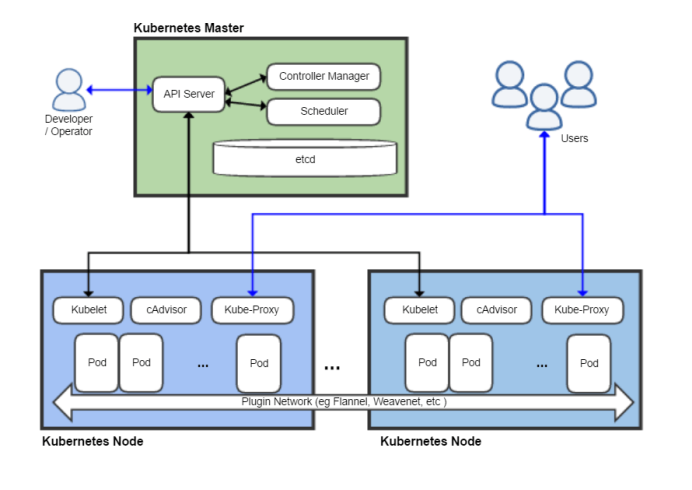

M300 - 40 Kubernetes (K8s)
==========================

Diese Wikiseite zeigt beinhaltet eine kleine Einführung in Kubernetes.

#### Lernziele

Sie können einen einfachen Kubernetes Kluster aufsetzen.

#### Voraussetzungen

* [10 Toolumgebung](../10-Toolumgebung/)

#### Inhaltsverzeichnis
* 01 - [Grundbegriffe](#-01---grundbegriffe)
* 02 - [Kubernetes](#-02---kubernetes)
* 03 - [Kubernetes Cluster](#-03---kubernetes-cluster)
* 04 - [Reflexion](#-04---reflexion)
* 05 - [Fragen](Fragen.md)
* 06 - [Kubernetes hands-on](K8s.md)
* 07 - [Quellenverzeichnis](#-07---quellenverzeichnis)

___

 01 - Grundbegriffe
======

> [⇧ **Nach oben**](#inhaltsverzeichnis)

### Service Discovery
***
 
Service Discovery ist der Prozess, Clients eines Service mit Verbindungsinformationen (normalerweise IP-Adresse und
Port) einer passenden Instanz davon zu versorgen.

In einem statischen System auf einem Host ist das Problem einfach zu lösen, denn es gibt nur eine Instanz von allem. 

In einem verteilten System mit mehreren Instanzen von Services, die kommen und gehen, ist das aber viel komplizierter. 

Eine Möglichkeit ist, dass der Client einfach den Service über den Namen anfordert (zum Beispiel db oder api) und im Backend dann ein bisschen Magie geschieht, die dazu die passenden Daten liefert. 

Für unsere Zwecke kann Vernetzung als der Prozess des Verknüpfens von Containern betrachtet werden. 

Es geht nicht darum, reale Ethernet-Kabel einzustecken. Containervernetzung beginnt mit der Annahme, dass es eine Route zwischen Hosts
gibt – egal, ob diese Route über das öffentliche Internet läuft oder nur über einen schnellen lokalen Switch.

Mit dem Service Discovery können Clients also Instanzen finden, und die Vernetzung kümmert sich darum, die Verbindungen herzustellen. 

Vernetzungs Service-Discovery-Lösungen haben häufig gemeinsame Funktionalität, da Service-Discovery-Lösungen auf Ziele im Netz verweisen und Vernetzungslösungen häufig auch Service-Discovery-Features enthalten.

Weitere Funktionen von Service Discovery können sein:

* Health Checking
* Failover 
* [Load Balancing](https://de.wikipedia.org/wiki/Lastverteilung_%28Informatik%29)
* Verschlüsselung der übertragenen Daten 
* Isolieren von Containergruppen.

### Lastverteilung (Load Balancing)
***

Mittels Lastverteilung (englisch Load Balancing) werden in der Informatik umfangreiche Berechnungen oder große Mengen von Anfragen auf mehrere parallel arbeitende Systeme verteilt. 

Insbesondere bei Webservern ist eine Lastverteilung wichtig, da ein einzelner Host nur eine begrenzte Menge an HTTP-Anfragen auf einmal beantworten kann. 

Für unsere Zwecke kann Lastverteilung als der Prozess des Verteilens von Anfragen auf verschiedene Container betrachtet werden.

### Cluster
***

Ein [Rechnerverbund oder Computercluster](https://de.wikipedia.org/wiki/Rechnerverbund), meist einfach Cluster genannt (vom Englischen für „Rechner-Schwarm“, „-Gruppe“ oder „-Haufen“), bezeichnet eine Anzahl von vernetzten Computern. 

Der Begriff wird zusammenfassend für zwei unterschiedliche Aufgaben verwendet: 
* die Erhöhung der Rechenkapazität (HPC-Cluster) 
* die Erhöhung der Verfügbarkeit (HA-Cluster, engl. high available - hochverfügbar). 

Die in einem Cluster befindlichen Computer (auch Knoten, vom englischen nodes oder Server) werden auch oft als Serverfarm bezeichnet.

 02 - Kubernetes
======

> [⇧ **Nach oben**](#inhaltsverzeichnis)

Kubernetes in 5 Minuten auf YouTube

---

Kubernetes (auch als „K8s“ oder einfach „K8“ bezeichnet - *sprich immer: 'Kuhbernetties'*) ist ein Open-Source-System zur Automatisierung der Bereitstellung, Skalierung und Verwaltung von Container-Anwendungen, das ursprünglich von Google entworfen und an die Cloud Native Computing Foundation gespendet wurde. Es zielt darauf ab, eine „Plattform für das automatisierte Bespielen, Skalieren und Warten von Anwendungscontainern auf verteilten Hosts“ zu liefern. Es unterstützt eine Reihe von Container-Tools, einschließlich Docker.

Die Orchestrierung mittels Kubernetes wird von führenden Cloud-Plattformen wie Microsofts Azure, IBMs Bluemix, Red Hats OpenShift und Amazons AWS unterstützt.

### Merkmale
***

* Immutable (Unveränderlich) statt Mutable.
* Deklarative statt Imperative (Ausführen von Anweisungen) Konfiguration.
* Selbstheilende Systeme - Neustart bei Absturz.
* Entkoppelte APIs – LoadBalancer / Ingress (Reverse Proxy).
* Skalieren der Services durch Änderung der Deklaration.
* Anwendungsorientiertes statt Technik (z.B. Route 53 bis AWS) Denken.
* Abstraktion der Infrastruktur statt in Rechnern Denken.

### Objekte
***

* **Pod** - Ein [Pod](https://kubernetes.io/docs/concepts/workloads/pods/pod/) repräsentiert eine Gruppe von Anwendungs-Containern und Volumes,
die in der gleichen Ausführungsumgebung (gleiche IP, Node) laufen.
* **ReplicaSet**: [ReplicaSets](https://kubernetes.io/docs/concepts/workloads/controllers/replicaset/) bestimmen wieviele Exemplare eines Pods laufen und stellen sicher, dass die angeforderte Menge auch verfügbar ist. 
* **Deployment**: [Deployments](https://kubernetes.io/docs/concepts/workloads/controllers/deployment/) erweitern ReplicaSets um deklarative Updates (z.B. von Version 1.0 auf 1.1) von Container Images.
* **Service**: Ein [Service](https://kubernetes.io/docs/concepts/services-networking/service/) steuert den Zugriff auf einen Pod (IP-Adresse, Port). Während Pods (bzw. Images) ersetzt werden können (z.B. durch Update auf neue Version) bleibt ein Service stabil.
* **Ingress**: Ähnlich einem Reverse Proxy ermöglicht ein [Ingress](https://kubernetes.io/docs/concepts/services-networking/ingress/) den Zugriff auf einen Service über einen URL.

Weitere siehe [Kubernetes Concepts](https://kubernetes.io/docs/concepts/).

Unterhaltsame Broschüre mit dem Titel ["Phippy Goes to the Zoo – A Kubernetes Story"](https://azure.microsoft.com/en-us/resources/phippy-goes-to-the-zoo/en-us/), zeigt in der Form eines Kinderbuches wesentliche Objekte von Kubernetes auf.

### Installation
***

Für die Installation verwenden Sie die Anleitung vom Projekt:

* [Docker und Kubernetes – Übersicht und Einsatz](https://github.com/mc-b/duk)

### Beispiel YAML Datei
***

Ein Apache Web Server kann wie folgt Bereitgestellt werden:
	
	apiVersion: v1
	kind: Service
	metadata:
	  name: apache
	  labels:
	    app: apache
	    group: web
	    tier: frontend
	spec:
	  type: LoadBalancer
	  ports:
	  - port: 80
	    protocol: TCP
	  selector:
	    app: apache
	---
	
	apiVersion: apps/v1
	kind: Deployment
	metadata:
	  name: apache
	spec:
	  replicas: 1
	  selector:
	    matchLabels:
	      app: apache
	  template:
	    metadata:
	      labels:
	        app: apache
	        group: web
	        tier: frontend
	    spec:
	      containers:
	      - name: apache
	        image: httpd
	        ports:
	        - containerPort: 80
	          name: apache
	          
### Links

* [Homepage](http://kubernetes.io)
* [Beispiele](https://github.com/mc-b/duk)
* [Explaining Kubernetes in 10 minutes using an analogy](https://opensource.com/article/20/7/kubernetes-analogy)
* [50 Best Kubernetes Architecture Tutorials](https://securityboulevard.com/2019/04/50-best-kubernetes-architecture-tutorials/)
* [Container Design Patterns for Kubernetes - Part 1](https://www.weave.works/blog/container-design-patterns-for-kubernetes/)

 03 - Kubernetes Cluster
======

> [⇧ **Nach oben**](#inhaltsverzeichnis)

Quelle: <a href="https://elastisys.com/2018/01/25/setting-highly-available-kubernetes-clusters/">On setting up highly available Kubernetes clusters</a>

- - -

Bei einem Cluster wird ein Kubernetes Master und mehrere Worker erzeugt. Diese Umgebung eignet sich zur Demonstration einer Verteilten Umgebung.

**Voraussetzungen**

Genügend GB RAM für alle VM's, z.B. können bei einem 32 GB RAM System ca. 7 VM's à 4 GB RAM eingerichtet werden.

### Konfiguration
***

Siehe Datei [cluster-large.yaml](https://github.com/mc-b/lernkube/blob/master/templates/cluster-large.yaml) oder [cluster-small.yaml](https://github.com/mc-b/lernkube/blob/master/templates/cluster-small.yaml).

Die wichtigsten Konfigurationen:

	master:
	  count: 1
	  cpus: 2
	  memory: 5120
	worker:
	  count: 2

Es wird ein Master und zwei Worker Nodes erstellt. Der Master und die Worker Nodes werden während der Installation automatisch miteinander gejoint.

    use_dhcp: false  
    # Fixe IP Adressen mit welchen die IP fuer Master und Worker beginnen sollen
    ip:
      master:   192.168.137.100
      worker:   192.168.137.111
    # Netzwerk "private_network" fuer Host-only Netzwerk, "public_network" fuer Bridged Netzwerke
    net:
      network_type: private_network

Die restlichen Standardeinstellungen wie Host-only Netzwerk mit fixen IP-Adressen kann 1:1 verwendet werden. 

*Nachteil*: es kann nur vom Notebook wo sich die VMs befinden auf den Cluster zugegriffen werden. 

 04 - Reflexion
======

> [⇧ **Nach oben**](#inhaltsverzeichnis)

 07 - Quellenverzeichnis
====== 	

> [⇧ **Nach oben**](#inhaltsverzeichnis)

                  
	                  