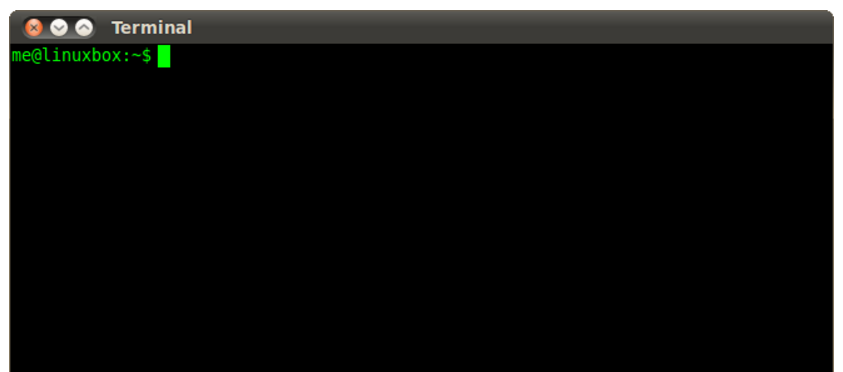

Bash
----

Linux Bash Shell

Quelle: <a href="http://linuxcommand.org/lc3_learning_the_shell.php">Learning the Shell</a>

- - -
[Bash (für Bourne-again shell)](https://de.wikipedia.org/wiki/Bash_(Shell)) ist eine freie Unix-Shell und Teil des GNU-Projekts. Sie ist heute auf vielen unixoiden Systemen die Standard-Shell.

### Nützliche Befehle 

**Administrator, Start und Stop Services und System **

*   `sudo [-i]` - Superuser werden, ein Password ist nicht erforderlich. –i = permanent
*   `sudo service <servicename> start|stop` - Starten und Stoppen eines Services z.B. apache2, mysql
*   `sudo shutdown –r now` - Restart des Betriebssystems
*   `sudo shutdown –h now` - Stoppen des Betriebssystems.

**Dateien bearbeiten und Filesystem**

*   `ls, rm, mv, cd` - Anzeigen, löschen, verschieben von Dateien und Wechsel Verzeichnis
*   `nano` oder `[vi](http://debiananwenderhandbuch.de/vi.html)` - Texteditoren
*   `df –h, free –m, w` - Diskbelegung, Speicherbelegung, Auslastung CPU

**Netzwerk**

*   `ifconfig` – Ausgabe der eigenen IP-Adresse
*   `netstat -a` oder `netstat -tulpen` - Ausgabe der verwendeten Network Ports
*   `net lookup <hostname>` - IP-Adresse für Hostname ausgeben.

**Prozesse**

*   `ps -ef` oder `top` - Anzeige der aktiven Prozesse
*   `kill <pid>` - Prozess laut Prozess-Id (Nummer) beenden

**Hilfsprogramme**

*   `curl http://<server>` - Aufruf einer Webseite oder eines HTTP REST Services
*   `wget http://<server>/<datei>` - kopieren einer Datei von einem Webserver
*   `dos2unix <Datei>` - Datei vom DOS ins UNIX/Linux Format umwandeln. Wird immer dann benötigt wenn eine Datei von Windows nach Linux kopiert wird und überflüssige CR enthält.

### Testen

Arbeiten Sie die Seite [Working With Commands](http://linuxcommand.org/lc3_lts0060.php) durch.

### Links

* [Bash auf Wikipedia](https://de.wikipedia.org/wiki/Bash_(Shell))
* [Learning the Shell](http://linuxcommand.org/lc3_learning_the_shell.php)
* [Advanced Bash-Scripting Guide](http://tldp.org/LDP/abs/html/index.html)
* [Informationen zu einem Befehl](https://wiki.ubuntuusers.de/Howto/Informationen_zu_einem_Befehl/)
