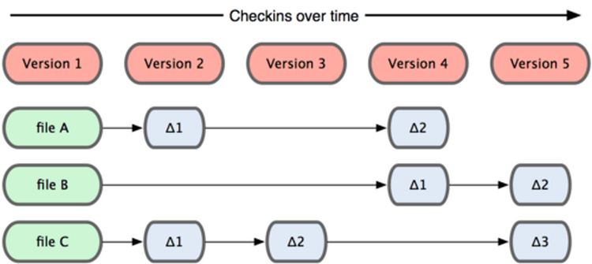

Versionsverwaltung 
------------------

Quelle: <a href="https://git-scm.com/book/de/v1/Los-geht%E2%80%99s-Git-Grundlagen">Git Buch</a/>

- - -

Eine [Versionsverwaltung](https://de.wikipedia.org/wiki/Versionsverwaltung) ist ein System, das zur Erfassung von Änderungen an Dokumenten oder Dateien verwendet wird. Alle Versionen werden in einem Archiv mit Zeitstempel und Benutzerkennung gesichert und können später wiederhergestellt werden. Versionsverwaltungssysteme werden typischerweise in der Softwareentwicklung eingesetzt, um Quelltexte zu verwalten. Versionsverwaltung kommt auch bei Büroanwendungen oder Content-Management-Systemen zum Einsatz.

### Hauptaufgaben

* Protokollierungen der Änderungen: Es kann jederzeit nachvollzogen werden, wer wann was geändert hat.
* Wiederherstellung von alten Ständen einzelner Dateien: Somit können versehentliche Änderungen jederzeit wieder rückgängig gemacht werden.
* Archivierung der einzelnen Stände eines Projektes: Dadurch ist es jederzeit möglich, auf alle Versionen zuzugreifen.
* Koordinierung des gemeinsamen Zugriffs von mehreren Entwicklern auf die Dateien.
* Gleichzeitige Entwicklung mehrerer Entwicklungszweige (engl. Branches) eines Projektes.

