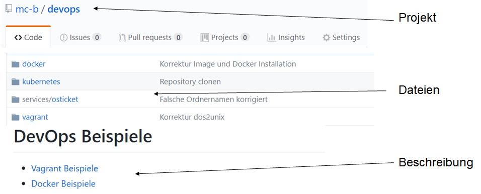

Repository
----------

 

- - -

[Ein Repository](https://de.wikipedia.org/wiki/Repository) (englisch für Lager, Depot oder auch Quelle; deutsch Plural Repositorien), auch – direkt aus dem Lateinischen entlehnt – Repositorium (Pl. Repositorien), ist ein verwaltetes Verzeichnis zur Speicherung und Beschreibung von digitalen Objekten für ein digitales Archiv. Bei den verwalteten Objekten kann es sich beispielsweise um Programme (Software-Repository), Publikationen (Dokumentenserver), Datenmodelle (Metadaten-Repository) oder betriebswirtschaftliche Verfahren handeln. Häufig beinhaltet ein Repository auch Funktionen zur Versionsverwaltung der verwalteten Objekte.

[Git](https://de.wikipedia.org/wiki/Git) ist eine freie Software zur verteilten Versionsverwaltung von Dateien, die durch Linus Torvalds initiiert wurde.

[GitHub](https://github.com/) ist ein webbasierter Online-Dienst, der Software-Entwicklungsprojekte auf seinen Servern bereitstellt. Namensgebend war das Versionsverwaltungssystem Git. Zusätzlich bietet er diverse Management und Bug-Tracking-Funktionalitäten.

[GitLab](https://gitlab.com/) ist eine Webanwendung zur Versionsverwaltung für Softwareprojekte auf Basis von git. Sie bietet diverse Management und Bug-Tracking-Funktionalitäten, sowie mit GitLab CI ein System zur [Kontinuierlichen Integration](https://de.wikipedia.org/wiki/Kontinuierliche_Integration). 

### Testen

* Legen Sie Ihr eigenes Repository an [Create A Repo](https://help.github.com/articles/create-a-repo/).

oder

* [Youtube: GitHub - Einrichtung und eigenes Repository anlegen](https://www.youtube.com/watch?v=bTdFNvB42U4)

### Links

* [Git Buch](https://git-scm.com/book/de/v1) 
* [Online Training](https://try.github.io/levels/1/challenges/1)
* [Git auf dem Server - Einrichten des Servers](https://git-scm.com/book/de/v1/Git-auf-dem-Server-Einrichten-des-Servers)
* [Git Repository basierend auf Docker und Gitblit](https://hub.docker.com/r/jacekkow/gitblit/)

