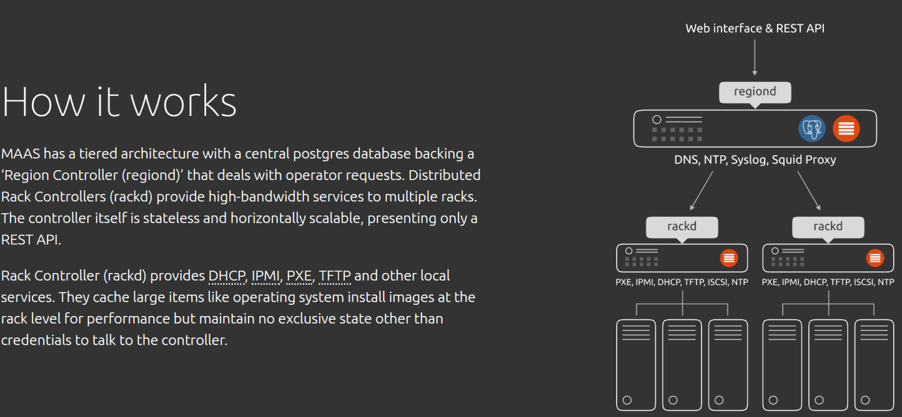

MAAS
====

Quelle: [MAAS How its works](https://maas.io/how-it-works)

- - - 

MAAS / Linux Container Umgebung um Cluster von VMs oder Kubernetes auszusetzen

[MAAS](https://maas.io/how-it-works) steht für Self-Service-Remote-Installation von Windows, CentOS, ESXi und Ubuntu auf realen Servern. Es verwandelt das Rechenzentrum in eine Bare-Metal-Cloud.

Für Details und Installation siehe [hier](https://github.com/mc-b/lernmaas/tree/master/doc/MinM#konfiguration).

**ACHTUNG** VMs in VMs ist sehr langsam in Virtualbox.